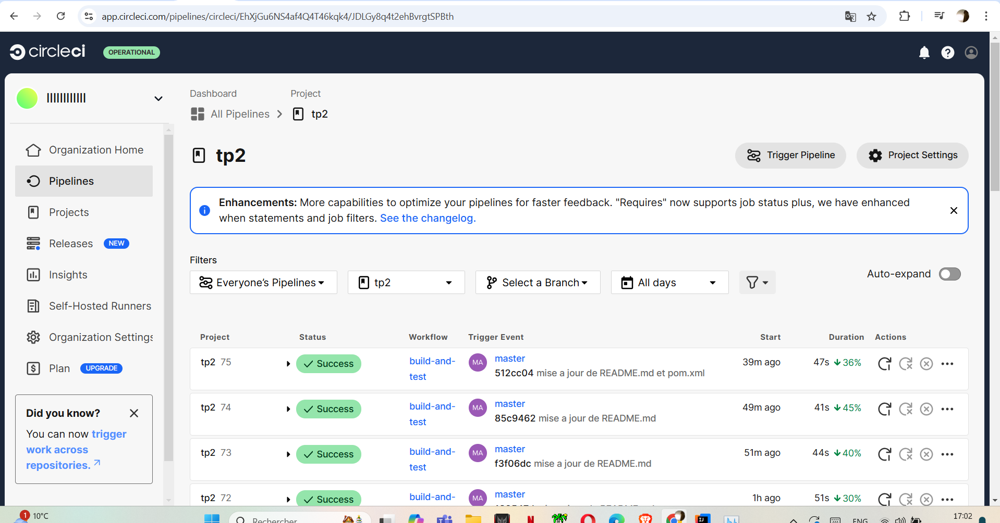

### Nom et prénom : 
Noureddine Markhi 
### Groupe: 
IA
### Un badge pour CircleCI :
[](https://dl.circleci.com/status-badge/redirect/circleci/EhXjGu6NS4af4Q4T46kqk4/JDLGy8q4t2ehBvrgtSPBth/tree/main)

### Un badge pour la couverture de test :


[](https://codecov.io/gh/NoureddineMarkhi/ceri-m1-techniques-de-test)


### Un badge pour checkstyle

### Lien de Javadoc
https://noureddinemarkhi.github.io/ceri-m1-techniques-de-test/fr/univavignon/pokedex/api/package-summary.html
# Documentation du projet **Pokedex API**

---

## **1. Outils utilisés**

- **Java 17** : Langage principal utilisé pour développer le projet.
- **JUnit 5** : Framework pour les tests unitaires.
- **Mockito** : Bibliothèque pour les tests basés sur les mocks.
- **Maven** : Outil de gestion de projet pour la gestion des dépendances.
- **Codecov / Jacoco** : Outils d'analyse de couverture de tests.
- **GitHub** : Hébergement du code source et intégration continue.
- **CircleCI** : Outil d'intégration continue pour automatiser les builds et les tests.

---

## **2. Architecture**

Le projet est organisé selon une architecture **Modulaire et Orientée Objet** :


### **2.2. Description des composants**

1. **Interfaces** :  
   Définissent les comportements attendus (ex. `IPokemonFactory`, `IPokedex`).

2. **Implémentations** :  
   Les classes concrètes qui implémentent les interfaces :
    - `Pokedex` : Gestion des Pokémons.
    - `PokemonFactory` : Création des Pokémons.
    - `PokemonMetadataProvider` : Fournit les métadonnées des Pokémons.

3. **Utils** :  
   Contient les comparateurs de tri pour les Pokémons (`PokemonComparators`).

4. **Tests** :  
   Des tests unitaires pour chaque interface et implémentation avec **Mockito** pour les mocks.

---

## **3. Choix techniques d'implémentation**

### **3.1. Utilisation des interfaces**
Le projet est basé sur une architecture **orientée interface** pour faciliter la modularité et l'extensibilité. Chaque fonctionnalité principale possède une interface (`IPokedex`, `IPokemonFactory`) et une implémentation concrète.

Exemple :
```java
public class PokemonFactory implements IPokemonFactory {
    @Override
    public Pokemon createPokemon(int index, int cp, int hp, int dust, int candy) {
        return new Pokemon(index, "Pokemon-" + index, 100 + index, 100 + index, 100 + index, cp, hp, dust, candy, 0.0);
    }
}
```


### **4. Conclusion
Le projet Pokedex API est conçu pour être modulaire, testable et maintenable.

Outils modernes : (JUnit, Mockito, Maven, CircleCI).
Architecture claire (interfaces/implémentations/tests).
Tests complets avec une couverture de code de 100% pour assurer la fiabilité du projet.